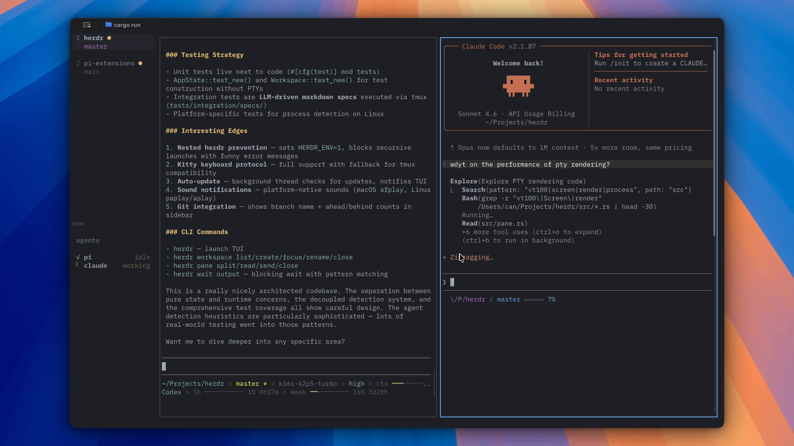

# herdr-dotfiles


Personal [herdr](https://herdr.dev) config — modifier-only pane navigation, catppuccin theme, all agents visible.



> Screenshot from [ogulcancelik/herdr](https://github.com/ogulcancelik/herdr)

---

## What is herdr?

[herdr](https://github.com/ogulcancelik/herdr) is a terminal multiplexer built for AI coding agents. Think tmux, but with live agent status (blocked / working / done) visible at a glance — run multiple Claude, Codex, or Cursor sessions side-by-side in workspaces, tabs, and panes. Single Rust binary, no Electron, no GUI app.

---

## What this config changes from herdr defaults

> **Prefix = `ctrl+space`** (herdr default is `ctrl+b`, same as tmux)

### 🔑 Prefix

Default `ctrl+b` → **`ctrl+space`**

### 🪟 Pane navigation

No prefix needed. Hold modifiers and tap arrow keys from anywhere.

| Key | Action |
|-----|--------|
| `Shift+Alt+←` | Focus pane left |
| `Shift+Alt+↓` | Focus pane down |
| `Shift+Alt+↑` | Focus pane up |
| `Shift+Alt+→` | Focus pane right |

### 📂 Workspace switching

> Prefix = `ctrl+space`

| Key | Action |
|-----|--------|
| `Prefix+{` | Previous workspace |
| `Prefix+}` | Next workspace |

### 🤖 Agent switching

| Key | Action |
|-----|--------|
| `Prefix+,` | Previous agent |
| `Prefix+.` | Next agent |
| `Prefix` then `Alt+1..9` | Jump to agent by number |

### ✂️ Splits

| Key | Action |
|-----|--------|
| `Prefix+\` | Split vertical |
| `Prefix+-` | Split horizontal |

### 🎨 UI

| Setting | This config | Note |
|---------|-------------|------|
| Theme | catppuccin | |
| Sound | disabled | |
| Toast delivery | herdr | notifications appear inside herdr, not OS-level |
| Agent labels on pane borders | on | |
| Agent panel scope | all | show agents from all workspaces, not just active one |
| Onboarding | disabled | see [herdr docs](https://herdr.dev/docs) for guided intro |

---

## Setup

### 1. Install herdr

```bash
curl -fsSL https://herdr.dev/install.sh | sh
```

Or with Homebrew:

```bash
brew install herdr
```

### 2. Clone and link this config

```bash
git clone https://github.com/Taeyoung96/herdr-dotfiles.git
cd herdr-dotfiles
chmod +x install.sh
./install.sh
```

Symlinks keep the live config up to date — no re-run needed after `git pull`.

### 3. Start herdr

```bash
herdr
```

### 4. Apply config changes to a running session

```bash
herdr server reload-config
```

---

## Requirements

- Linux or macOS
- herdr — [install docs](https://herdr.dev/install)
